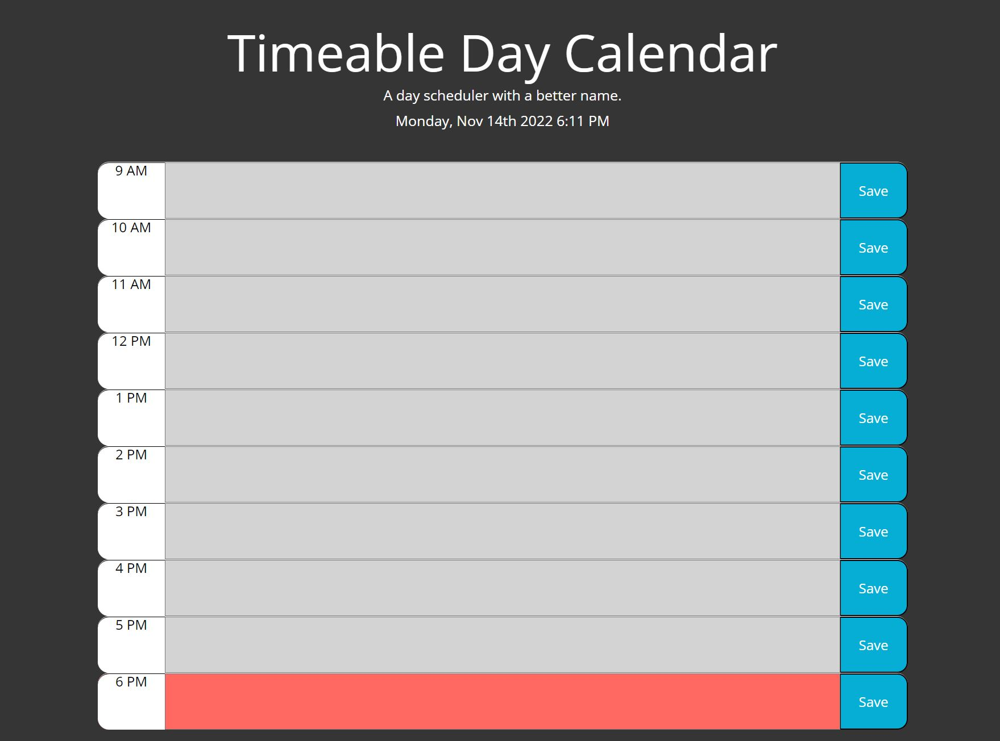

# Day Scheduler

## Description

My motivation for the following project was to build a day scheduler website. Constructing a day scheduler website is helpful for many coders since it is a typical interview project. This website helped me learn javascript, along with jquery and bootstrap. I built this project to test my javascript skills and learn more about coding and web development. 

## Table of Contents

- [Installation](#installation)
- [Usage](#usage)
- [Credits](#credits)
- [License](#license)

## Installation

- Click the repository link
- Click the code button
- Navigate to the SHH tab and copy to clip board
- Open gitbash and type 'git clone (paste SHH option)'
- Type 'cd schedule-organizer' followed by 'code .'
- Feel free to code 

## Usage
    
A screenshot of the working website.

## Credits

[bootstrap](https://getbootstrap.com/)

[jquery](https://jqueryui.com/)

## License

[MIT-License](./LICENSE)

## Badges

## Features

[link to live website](https://kylecosaert.github.io/schedule-organizer/)

[link to repo](https://github.com/KyleCosaert/schedule-organizer.git)
